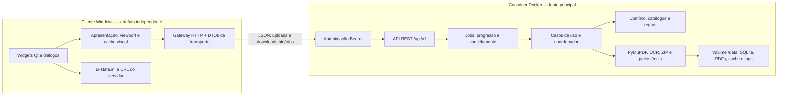

# Roadmap da migração para arquitetura cliente-servidosr

- Estado geral: **PLANEJADO**
- Data do planejamento: **2026-08-17**
- Responsável pelo planejamento: **Codex**
- Próxima etapa liberada: **Etapa 12** (**PENDENTE; não iniciada e não executada neste trabalho**)
- Regra de execução: uma etapa só pode começar quando todas as suas dependências estiverem
  marcadas como **CONCLUÍDA**.

## Objetivo final

Transformar o Zeny Project Handler em dois artefatos independentes:

1. um cliente Windows magro, responsável somente pela interface Qt, interação com arquivos locais,
   apresentação, cache visual descartável e comunicação HTTP;
2. um servidor executado em um container Docker, responsável por domínio, casos de uso, regras,
   análise de PDF, OCR, renderização, conformidade, persistência, arquivos gerenciados, operações
   longas e recuperação.

Ao final, todas as funcionalidades visíveis da aplicação atual devem continuar disponíveis. O
cliente distribuído não pode conter a lógica interna, os seeds de catálogo/regras, adaptadores de
persistência, PyMuPDF, Tesseract, SQLAlchemy ou código dos casos de uso.

## Como manter este roadmap

### Estados permitidos

Cada etapa deve usar exatamente um destes estados:

- **PENDENTE**: ainda não iniciada e sem impedimento conhecido;
- **EM DESENVOLVIMENTO**: existe um chat trabalhando ativamente na etapa;
- **EM VALIDAÇÃO**: implementação pronta, mas falta comprovar algum critério de aceite;
- **CONCLUÍDA**: todos os critérios e gates foram comprovados e as evidências foram registradas;
- **BLOQUEADA POR ERRO**: um erro impede progresso seguro; o bloco de evidências deve conter causa,
  comando que reproduz e ação necessária;
- **CANCELADA**: decisão explícita do responsável pelo produto; não usar para falha técnica.

Ao iniciar uma etapa, o agente deve alterar seu estado para **EM DESENVOLVIMENTO** e registrar data
e escopo. Antes de finalizar, deve passar por **EM VALIDAÇÃO**. Só deve marcar **CONCLUÍDA** depois de
executar todos os testes exigidos. Se houver falha que não possa ser resolvida no escopo, deve marcar
**BLOQUEADA POR ERRO** e não iniciar a etapa seguinte.

### Regras obrigatórias para todo chat de execução

1. Ler este documento inteiro, o `README.md`, a especificação funcional e os ADRs relevantes.
2. Conferir `git status --short` e preservar mudanças do usuário.
3. Confirmar que as dependências da etapa estão **CONCLUÍDA**.
4. Mudar somente a etapa atual para **EM DESENVOLVIMENTO** antes de editar código.
5. Não reduzir funcionalidades, cobertura, validações de integridade ou auditabilidade para fazer a
   migração passar.
6. Criar testes para todo contrato ou comportamento novo e adaptar testes existentes sem apagá-los
   apenas porque exercitam a arquitetura antiga.
7. Não iniciar a etapa seguinte no mesmo chat.
8. Registrar, no fim da etapa, comandos executados, resultados, cobertura, limitações e arquivos
   relevantes no bloco **Evidências**.
9. Executar `IniciarTestes.bat` no encerramento de toda etapa. A partir da Etapa 2, executar também
   os gates específicos de servidor/contrato; a partir da Etapa 9, executar os gates dos artefatos
   cliente e servidor.
10. Não criar commit ou publicar artefato remoto salvo se a mensagem do usuário pedir isso
    explicitamente.

## Diagnóstico da arquitetura atual

O bootstrap em `src/zeny_project_handler/bootstrap.py` compõe, dentro do mesmo processo Qt:

- SQLite/Alembic e unidades de trabalho;
- catálogo técnico e registro de regras;
- PyMuPDF, cache de análise e Tesseract;
- pipelines de extração, interpretação, promoção e conformidade;
- revisão humana, portabilidade, backup e recuperação;
- leitor e renderizador progressivo de PDF;
- coordenador global de operações;
- `MainWindow` e todos os painéis.

A interface importa diretamente tipos de `application`, `domain`, `ports` e adaptadores concretos.
Além de chamar serviços, ela ainda deriva regiões/vãos, valida arquivos, abre sessões PyMuPDF e
executa a fila de renderização local. Portanto, apenas colocar os serviços atuais atrás de HTTP não
é suficiente: os modelos enviados à interface também precisam ser substituídos por DTOs de
apresentação e toda decisão de negócio deve permanecer no servidor.

O relatório de qualidade existente registra 502 testes aprovados e cobertura de 86,39%. A Etapa 0
deve gerar uma nova linha de base antes de qualquer alteração estrutural.

## Arquitetura-alvo obrigatória



### Fronteira do cliente

Pode permanecer no cliente:

- PySide6, widgets, tema, ícone, identidade da janela e atalhos;
- seleção local de arquivos e escolha do destino de downloads;
- serialização de requisições, mensagens de erro seguras e DTOs sem comportamento de negócio;
- planejamento do viewport, composição de `QImage/QPixmap`, overlays já calculados pelo servidor e
  cache LRU descartável de raster recebido;
- estado puramente visual (`ui-state.ini`), URL do servidor e preferências não sensíveis;
- senha do servidor e senhas de PDF apenas em memória durante a sessão.

Não pode estar no artefato do cliente:

- `domain`, `application`, `ports` de negócio ou adaptadores do servidor;
- SQLAlchemy, Alembic, SQLite de negócio, PyMuPDF ou Tesseract;
- JSONs de catálogo, interpretação ou conformidade;
- avaliação de regras, interpretação, detecção de regiões/vãos ou geração de callouts;
- abertura, validação, hashing ou renderização de PDF como regra da aplicação;
- código de backup, importação, recuperação ou manipulação de arquivos gerenciados.

### Fronteira do servidor

O servidor é a única fonte de verdade. Ele deve:

- armazenar SQLite, PDFs enviados, fotos, pacotes temporários, cache, journals e logs em `/data`;
- copiar uploads para armazenamento gerenciado; nunca tentar abrir um caminho do Windows recebido
  no JSON;
- usar um único processo worker enquanto o coordenador de operações e credenciais permanecerem em
  memória, evitando coordenação inconsistente entre workers;
- responder DTOs próprios da API, sem serializar entidades SQLAlchemy ou agregados internos
  diretamente;
- manter operações mutáveis idempotentes quando houver risco de repetição por falha de rede;
- devolver conflitos como HTTP 409 e erros de domínio em envelope estável, sem traceback;
- executar renderização, OCR, interpretação, conformidade e portabilidade dentro do container.

### Autenticação simples definida para este projeto

- O segredo vem exclusivamente de `ZENY_SERVER_PASSWORD`.
- Docker Compose lê `.env` e injeta o valor no container em **runtime**. `.env` deve estar no
  `.gitignore` e no `.dockerignore`; não usar `ARG`, `ENV` com valor real ou `COPY .env` no
  `Dockerfile`.
- `.env-example` é versionado com placeholder e orientação.
- O cliente apresenta URL e senha num diálogo de conexão, testa a sessão e mantém a senha somente
  em memória. A URL pode ser lembrada; a senha não.
- Toda rota protegida recebe `Authorization: Bearer <senha>`.
- Comparar o segredo em tempo constante (`hmac.compare_digest`). Senha ausente, vazia ou igual ao
  placeholder deve impedir a inicialização do servidor.
- Falta ou erro de senha retorna 401 com a mesma resposta genérica e `WWW-Authenticate: Bearer`.
- `GET /health/live` pode ser público, mas só informa que o processo está vivo. Diagnósticos,
  versão, prontidão, OCR e dados ficam em rota autenticada.
- Não registrar `Authorization`, senha do servidor ou senha de PDF.

Este esquema é deliberadamente simples para uma rede local confiável. Em HTTP puro, a senha pode
ser observada por alguém com acesso ao tráfego. Se a rede deixar de ser confiável, TLS por proxy
reverso ou VPN passa a ser requisito antes da exposição. A imagem Docker protege a lógica contra os
clientes da API, mas não contra alguém com acesso administrativo ao host Docker ou à própria
imagem.

### Contrato HTTP mínimo a ser estabilizado

Todas as rotas, exceto `GET /health/live`, ficam sob `/api/v1` e exigem Bearer. A lista abaixo é o
escopo funcional; nomes finais devem ser fixados na especificação OpenAPI da Etapa 1.

| Grupo | Operações obrigatórias |
|---|---|
| sessão | validar senha, versão/capacidades, prontidão e diagnóstico OCR |
| projetos | listar, criar, abrir/detalhar, alterar NS e excluir |
| documentos | upload por streaming, preflight, desbloqueio de PDF, ordenação e remoção |
| visualizador | sessão temporária para PDF avulso, metadados de páginas, prévia e tiles |
| jobs | criar, consultar, observar progresso, obter resultado e cancelar |
| análise | iniciar pipeline completo e refletir operação global |
| revisão | listar sessões/propostas/regiões/vãos, aceitar, ajustar, rejeitar e criar manualmente |
| documentação | campos documentais, navegação e evidências normalizadas |
| conformidade | última execução, histórico, executar análise, resultados e callouts |
| regras | revisão ativa, números, preflight/importação confirmada e download do JSON |
| portabilidade | preflight/importação de `.zphproj`, exportação e download |
| backup | preflight/criação/download e upload/preflight/restauração confirmada |
| fotos | listar, anexar, remover e baixar fotos gerenciadas já suportadas pelo serviço atual |

Requisitos transversais do contrato:

- envelope de erro: `code`, `message`, `correlation_id` e `details` opcional seguro;
- datas ISO-8601 com timezone, UUIDs em texto, decimais em texto quando precisão importar;
- upload/download em streaming, limites configuráveis e nomes de arquivo saneados;
- `Idempotency-Key` em criação de job/upload e ausência de retry automático para mutações;
- resposta 202 para jobs; polling limitado no cliente (valor inicial entre 250 e 500 ms);
- raster como `image/png` ou outro formato sem perda aprovado pelo teste visual, com metadados em
  headers/DTO; nunca enviar objetos PyMuPDF;
- OpenAPI versionada e testada contra snapshot;
- nenhuma rota aceita caminho de arquivo do cliente ou destino arbitrário do servidor.

## Artefatos oficiais de release e separação física

A separação não será considerada concluída apenas porque cliente e servidor usam processos
diferentes no repositório de desenvolvimento. A release precisa produzir entregas físicas distintas
e destinadas a públicos distintos:

### Pacote entregue aos usuários do cliente

- `ZenyProjectHandler-Client-<versao>-win-x64.zip`, autocontido e executável sem Python instalado;
- opcionalmente, um instalador Windows com a mesma composição, quando a ferramenta de empacotamento
  e eventual certificado estiverem disponíveis;
- `LEIA-ME-CLIENTE.md`, com instalação, URL do servidor, conexão, atualização e remoção;
- nenhum fonte, wheel, módulo, seed, dependência ou configuração pertencente ao servidor;
- nenhuma senha predefinida. A senha é digitada no primeiro acesso e mantida somente em memória.

### Kit entregue somente ao administrador do servidor

- `ZenyProjectHandler-Server-<versao>.oci.tar`, imagem OCI/Docker exportada e identificada também por
  digest, ou referência imutável equivalente em registry privado;
- `compose.release.yaml` usando `image:` e digest/tag de release, sem `build:` e sem exigir o
  repositório ou código-fonte na máquina de produção;
- `.env-example`, scripts documentados de carga da imagem, start, stop, health, atualização,
  backup e rollback;
- `LEIA-ME-SERVIDOR.md`, incluindo volume, porta LAN, firewall e troca de senha.

### Manifesto comum da release

- `RELEASE_NOTES.md` com versão do cliente, servidor, API, schema e migração;
- `SHA256SUMS.txt` cobrindo todos os arquivos distribuídos;
- `release-manifest.json` com nomes, tamanhos, SHA-256, versão mínima/máxima compatível da API e
  digest da imagem;
- SBOM/lista de dependências separada para cliente e servidor;
- evidência de teste em uma máquina Windows limpa para o cliente e em um host Docker limpo para o
  servidor.

O bundle final deve poder ser montado em `dist/release/<versao>/` por um único comando reproduzível.
Esse diretório é saída de build e não deve ser versionado. O cliente deve validar a compatibilidade
da API na conexão e recusar, com mensagem clara, uma combinação incompatível.

## Inventário de paridade funcional

| Funcionalidade atual | Dono final | Prova mínima de paridade |
|---|---|---|
| criar/abrir/alterar NS/excluir projeto | servidor | teste API + fluxo Qt real |
| selecionar e importar múltiplos PDFs | seleção no cliente; conteúdo no servidor | upload streaming, hash e reabertura após apagar a cópia local |
| senha de PDF, três tentativas e descarte seguro | diálogo cliente; validação/memória no servidor | testes de senha correta/incorreta, reinício e ausência em logs/banco |
| reordenar páginas e remover documentos | servidor | ordem persistida após reinício do container |
| PDF avulso no visualizador | servidor com sessão temporária | upload temporário, render, expiração e limpeza |
| zoom, rotação, prévia, tiles e paginação | UI + render do servidor | comparação visual/dimensional e cancelamento de pedidos obsoletos |
| análise, OCR, interpretação e promoção | servidor | mesmo resultado de fixture e progresso/cancelamento por job |
| regiões, elementos, relações e vãos | servidor | DTO de sessão e testes de paridade com projeção atual |
| revisão humana e criações manuais | servidor | decisões persistidas e conflitos seguros entre clientes |
| documentação, conformidade e callouts | servidor; desenho do overlay no cliente | snapshots equivalentes e navegação até evidência |
| importar/exportar regras | upload/download; validação no servidor | preflight, confirmação, revisão ativa e round trip JSON |
| `.zphproj`, `.zphbackup` e recuperação | servidor; seletor/download no cliente | round trip por rede, degradação e restauração após reinício |
| fotos gerenciadas | servidor | upload/download/hash e associação preservada |
| tema, docks e geometria da janela | cliente | restauração local independente do volume do servidor |
| coordenação global, progresso e cancelamento | servidor | dois clientes, conflito 409, progresso monotônico e cancelamento |

## Etapa 0 — Linha de base, ADR e caracterização

- Estado: **CONCLUÍDA**
- Dependências: nenhuma
- Entrega principal: linha de base reproduzível e decisões arquiteturais aceitas no repositório.

### Escopo

1. Executar o gate atual sem mudanças funcionais e registrar quantidade de testes, cobertura, tempo
   e ambiente.
2. Criar `docs/adr/0013-arquitetura-cliente-servidor.md` com a arquitetura-alvo deste roadmap,
   incluindo fronteiras, autenticação, armazenamento gerenciado, worker único, jobs, limitações de
   HTTP na LAN e consequência de o container ser a fonte principal.
3. Criar `docs/inventario-paridade-cliente-servidor.md` ligando cada ação visível da UI ao método
   atual, testes existentes, futuro endpoint e DTO esperado.
4. Adicionar testes de caracterização somente onde um comportamento crítico ainda não estiver
   coberto, especialmente ordem de folhas, PDFs protegidos, cancelamento, regras e portabilidade.
5. Validar que `.env` está ignorado, `.env-example` não contém segredo real e documentar que o
   segredo será injetado em runtime.
6. Registrar no ADR que uploads novos passam a ser cópias gerenciadas no servidor. A referência a
   caminhos externos do Windows não atravessa a nova fronteira.

### Critérios de aceite e comprovação

- `git check-ignore .env` retorna `.env` e `git check-ignore .env-example` não a ignora.
- `IniciarTestes.bat` termina com `RESULTADO FINAL: APROVADO` sem reduzir o limiar de 85,01%.
- O inventário cobre todos os itens da tabela de paridade e aponta ao menos um teste por fluxo.
- O ADR possui estado, contexto, decisão, consequências, riscos e alternativas rejeitadas.
- Nenhuma lógica ou dependência de execução muda nesta etapa.

### Evidências

- Início/data/agente: **2026-08-17 — Codex; dependências confirmadas: nenhuma; escopo limitado à
  linha de base, ADR 0013, inventário de paridade, caracterização necessária e validação de
  `.env`/`.env-example`.**
- Estado do gate inicial: **APROVADO em 2026-08-17 18:15:56 (execução válida fora do sandbox):
  `pip check`, Ruff lint, Ruff format, Mypy, Pytest/cobertura e complexidade E/F passaram;
  `RESULTADO FINAL: APROVADO`. Uma tentativa anterior dentro do sandbox foi inválida porque o
  executável-base da `.venv` no WindowsApps recebeu “Acesso negado” (código 103 em todas as
  seções); o mesmo `cmd.exe /d /c IniciarTestes.bat` foi repetido com autorização fora do sandbox.**
- Testes/cobertura/tempo: **linha de base inicial: 618 aprovados, 87,08%, Pytest 128,11 s. Gate
  final em 2026-08-17 18:25:01: 618 aprovados, 87,07%, Pytest 108,96 s, limiar inalterado em
  85,01%; 17.592 statements, 4.596 branches; 1.742 funções/métodos inspecionados e nenhum rank
  E/F. Ambiente: Microsoft Windows 10.0.26200.9168 x64, Python 3.13.14, pytest 8.4.2,
  pytest-cov 7.1.0, PySide6/Qt 6.11.1, PowerShell 7.6.4; `git` HEAD `86ad29daea6a`.**
- Arquivos criados ou alterados: **criados
  `docs/adr/0013-arquitetura-cliente-servidor.md` e
  `docs/inventario-paridade-cliente-servidor.md`; alterado somente este roadmap pela Etapa 0.
  Nenhum diff em `src/`, `tests/`, `pyproject.toml`, locks, setup, launchers ou gate. As mudanças
  preexistentes do usuário em `.gitignore`, `.env-example` e no roadmap foram preservadas.**
- Observações/bloqueios: **nenhum bloqueio. `git check-ignore .env` retornou `.env` (exit 0) e
  `git check-ignore .env-example` não a ignorou (exit 1); o exemplo contém apenas
  `ZENY_SERVER_PASSWORD=troque-por-uma-senha-longa-e-aleatoria`, e o ADR determina injeção em
  runtime. O inventário cobre as 15 linhas da matriz, referencia 49 node IDs pytest existentes e
  registra endpoint/DTO esperado por ação. Ordem de folhas, PDFs protegidos, cancelamento, regras e
  portabilidade já tinham caracterização específica aprovada; portanto nenhum teste redundante foi
  adicionado. Validações finais: `cmd.exe /d /c IniciarTestes.bat`, checks de ignore/placeholder,
  verificação automática das referências pytest, das seções do ADR e de whitespace. A variação de
  0,01 ponto percentual entre as duas medições não decorre de mudança de código e ambas superam o
  gate. Limitações de HTTP na LAN, worker único e acesso administrativo à imagem estão registradas
  no ADR. Etapa 1 não iniciada e nenhum commit criado.**

### Mensagem para um novo chat limpo do Codex

> Implemente somente a **Etapa 0 — Linha de base, ADR e caracterização** do arquivo
> `docs/roadmap-arquitetura-cliente-servidor.md`. Leia o roadmap inteiro antes de editar, confirme
> que a etapa não tem dependências pendentes, altere seu estado para EM DESENVOLVIMENTO e siga todo
> o escopo e os critérios de aceite. Preserve funcionalidades e mudanças existentes do usuário.
> Execute o gate completo, registre as evidências no próprio roadmap e só marque a etapa como
> CONCLUÍDA se todas as comprovações passarem. Não comece a Etapa 1 e não faça commit.

## Etapa 1 — Contratos de transporte e especificação da API v1

- Estado: **CONCLUÍDA**
- Dependências: Etapa 0 **CONCLUÍDA**
- Entrega principal: contratos estáveis, sem comportamento de negócio, e OpenAPI v1 revisável.

### Escopo

1. Criar o pacote `zeny_project_handler_contracts`, dependente apenas de stdlib e Pydantic, com os
   DTOs, enums e envelopes de erro necessários a todos os grupos listados no contrato mínimo.
2. DTOs devem ser projeções de transporte, não cópias comportamentais do domínio. Não incluir
   avaliação, derivação de região/vão, validação normativa ou acesso a arquivos.
3. Definir versão da API, política de compatibilidade, códigos de erro, paginação quando aplicável,
   UUID/data/decimal, metadados de raster, jobs, confirmações e idempotência.
4. Criar uma aplicação FastAPI mínima apenas para gerar a especificação e salvar o snapshot em
   `docs/api/openapi-v1.json`.
5. Criar testes de serialização ida/volta, rejeição de campos inválidos, estabilidade de enums e
   snapshot OpenAPI.
6. Adicionar gate de arquitetura que proíba o pacote de contratos de importar PySide6, domínio,
   aplicação, adaptadores, SQLAlchemy, PyMuPDF ou Tesseract.
7. Atualizar o inventário da Etapa 0 com rota, método HTTP, request, response e códigos esperados.

### Decisões que não podem ficar implícitas

- Separar preflight de confirmação para regras, projeto portátil e restauração de backup.
- Distinguir `document_id`, `page_id`, `upload_id`, `viewer_session_id`, `job_id` e
  `correlation_id`.
- Representar geometria normalizada no contrato sem expor classes internas.
- Prever `PDF_PASSWORD_REQUIRED`, `PDF_PASSWORD_INVALID`, `OPERATION_CONFLICT`, `STALE_STATE`,
  `UPLOAD_TOO_LARGE`, `INTEGRITY_ERROR` e `AUTHENTICATION_FAILED`.
- O contrato não aceita `Path` nem caminho canônico do servidor em requests/responses públicos.

### Critérios de aceite e comprovação

- Testes do pacote de contratos passam isoladamente.
- O snapshot OpenAPI cobre todos os grupos mínimos e falha se houver mudança não revisada.
- `rg`/teste AST prova que contratos não importam código protegido.
- `IniciarTestes.bat` permanece aprovado.

### Evidências

- Início/data/agente: **2026-08-17 18:35 -03:00 — Codex; Etapa 0 confirmada como CONCLUÍDA;
  escopo limitado aos contratos de transporte sem lógica de negócio, OpenAPI v1, testes/gates de
  arquitetura e atualização do inventário. Etapa 2 permanece PENDENTE.**
- Comandos e resultados: **validação direcionada final aprovada com
  `.venv\Scripts\python.exe -m pip check`, gerador OpenAPI, Ruff check/format, Mypy e
  `pytest tests\contracts --cov=zeny_project_handler_contracts
  --cov=zeny_project_handler_api_spec`: 28 testes aprovados em 3,03 s e cobertura direcionada de
  94,59% (888 statements, 48 não cobertos nos stubs deliberadamente não executáveis da aplicação
  declarativa). Gate completo `cmd.exe /d /c IniciarTestes.bat` aprovado em 2026-08-17 18:58:
  dependências, Ruff, formatação, Mypy, Pytest/cobertura e complexidade passaram; 646 testes
  aprovados em 128,43 s, cobertura total 87,36% sobre 18.480 statements e 4.596 branches, limiar
  inalterado em 85,01%; 1.791 funções/métodos inspecionados, nenhum rank E/F; `RESULTADO FINAL:
  APROVADO`.**
- Hash/versão do snapshot OpenAPI: **API `1.0.0`; faixa compatível `1.0.0`–`1.999.999`;
  `docs/api/openapi-v1.json` com 258.878 bytes, 45 paths, 48 operações, 126 schemas e SHA-256
  `e6bce9063c547f6390d3d1bd404bda0fc25b8def456affa4daffa698a48c2717`. O teste de snapshot
  compara a geração canônica integral e cobre os 13 grupos mínimos de negócio, além de health.**
- Arquivos relevantes: **criados `src/zeny_project_handler_contracts/` (DTOs, IDs, enums, erro e
  versionamento), `src/zeny_project_handler_api_spec/` (FastAPI exclusivamente declarativa),
  `scripts/generate_openapi_v1.py`, `docs/api/README.md`, `docs/api/openapi-v1.json` e
  `tests/contracts/`; atualizados `pyproject.toml`, `requirements.lock`, o inventário de paridade e
  este roadmap. Pydantic 2.13.4, FastAPI 0.141.1 e python-multipart 0.0.32 foram fixados com suas
  dependências transitivas.**
- Observações/bloqueios: **nenhum. O gate AST provou que contratos importam somente stdlib,
  Pydantic e o próprio pacote; também recusou funções/métodos de negócio, `Path`, campos públicos de
  caminho e imports do runtime protegido. A aplicação de especificação importa somente FastAPI e
  contratos e não compõe servidor/casos de uso. DTOs rejeitam campos extras, datas sem timezone,
  enums/decimais inválidos e nomes de arquivo com componentes de caminho; senhas PDF ficam ocultas
  no `repr`. Preflight/confirm foram separados para regras, `.zphproj` e restauração; IDs,
  geometrias, erros, paginação, jobs 202/polling, idempotência, streaming e raster PNG estão
  explícitos. `git diff --check` e a inspeção de whitespace passaram. Mudanças preexistentes da
  Etapa 0 em `.gitignore`, `.env-example` e ADR 0013 foram preservadas. Nenhum commit foi criado
  durante a execução original; os commits das Etapas 0 e 1 foram autorizados posteriormente pelo
  usuário. Encerramento em 2026-08-17 18:59 -03:00; Etapa 2 permanece PENDENTE e não foi iniciada.**

### Mensagem para um novo chat limpo do Codex

> Implemente somente a **Etapa 1 — Contratos de transporte e especificação da API v1** descrita em
> `docs/roadmap-arquitetura-cliente-servidor.md`. Leia o documento inteiro, confirme a Etapa 0 como
> CONCLUÍDA, mude a Etapa 1 para EM DESENVOLVIMENTO e implemente DTOs sem lógica de negócio, a
> OpenAPI versionada e os gates de arquitetura. Rode os testes direcionados e `IniciarTestes.bat`,
> registre evidências e marque CONCLUÍDA apenas se todos os critérios passarem. Não inicie a Etapa 2
> e não faça commit.

## Etapa 2 — Servidor base, autenticação e Docker

- Estado: **CONCLUÍDA**
- Dependências: Etapa 1 **CONCLUÍDA**
- Entrega principal: container autenticado que inicializa a fonte de dados sem depender de Qt.

### Escopo

1. Criar `zeny_project_handler_server` com composição própria. Extrair do bootstrap atual uma
   composição de serviços reutilizável sem importar PySide6; o bootstrap Qt não pode ser carregado
   pelo servidor.
2. Implementar configurações de servidor e validação fail-closed de `ZENY_SERVER_PASSWORD`, host,
   porta, `/data`, nível de log e limites de upload/renderização.
3. Implementar middleware/dependência Bearer com comparação em tempo constante, resposta 401
   uniforme e redaction de segredos.
4. Implementar `GET /health/live` público e uma rota autenticada de sessão/prontidão com versão da
   API, capacidades e diagnóstico OCR seguro.
5. Criar `Dockerfile` multi-stage, `.dockerignore`, `compose.yaml` e healthcheck. Instalar Tesseract
   e português no estágio runtime Linux, executar como usuário não-root e montar volume em `/data`.
6. O Compose deve usar o `.env` local criado para desenvolvimento, mas a imagem não pode conter o
   arquivo. Fixar um único worker Uvicorn nesta fase.
7. Separar locks de dependências em servidor, cliente e desenvolvimento, preservando versões
   reproduzíveis.
8. Configurar shutdown ordenado de jobs/engine e correlação de logs por request sem registrar
   headers sensíveis.

### Critérios de aceite e comprovação

- Servidor sem senha, com senha vazia ou placeholder não inicia.
- `GET /health/live` responde sem senha e não revela configuração; rota de sessão retorna 401 sem
  senha e com senha errada, e 200 com senha correta.
- `docker compose build --no-cache` e `docker compose up -d` concluem; healthcheck fica healthy.
- Reiniciar/recriar o container preserva um marcador gravado no volume `/data`.
- Inspeção da imagem prova ausência de `.env` e ausência de PySide6.
- Testes unitários cobrem autenticação, redaction, config e lifecycle.
- `IniciarTestes.bat` permanece aprovado.

### Evidências

- Início/data/agente: **2026-08-17 19:08 -03:00 — Codex; Etapas 0 e 1 confirmadas como
  CONCLUÍDAS; escopo limitado ao servidor base sem Qt, configuração fail-closed, autenticação,
  health/prontidão, composição Docker/Compose, locks reproduzíveis, lifecycle, testes e gates da
  Etapa 2. Segredo exclusivamente injetado em runtime; Etapa 3 permanece PENDENTE.**
- ID/tag e tamanho da imagem: **`zeny-project-handler-server:dev`, ID
  `sha256:14c192cd354851ff253f296c062b2680d7bc962336238bffed827a1193e02e95`,
  173.388.404 bytes, criada em 2026-08-17 22:25:50 UTC por
  `docker compose build --no-cache`. Base resolvida como
  `python:3.13.7-slim-bookworm@sha256:adafcc17694d715c905b4c7bebd96907a1fd5cf183395f0ebc4d3428bd22d92d`.**
- Resultado dos testes 401/200/healthcheck: **Compose subiu e o container ficou `healthy`;
  `GET /health/live` retornou 200 e exatamente `{"live":true}`. `GET /api/v1/session` retornou a
  mesma resposta genérica 401, código `AUTHENTICATION_FAILED` e `WWW-Authenticate: Bearer` tanto
  sem header quanto com senha errada; com a senha runtime retornou 200, `ready=true`, API `1.0.0`
  e OCR `AVAILABLE`. A imagem encerrou com exit 1 nos três casos fail-closed: senha ausente, vazia
  e igual ao placeholder. Os 48 testes direcionados de servidor/contrato passaram em 12,60 s com
  cobertura combinada de 95,18%.**
- Prova de volume e ausência do `.env`: **o marcador `/data/.etapa2-volume-marker`, gravado pelo
  UID não-root 10001, permaneceu após `restart` e após `up -d --force-recreate`; o container mudou
  de `f6fed2b4c465...` para `e6daf255b2f1...` e voltou a `healthy`. A imagem tem zero arquivo
  `.env` em `/app`/site-packages, `PySide6` não está instalado, `pip check` não encontrou quebra,
  `Config.Env` e o histórico não possuem `ZENY_SERVER_PASSWORD` nem o valor runtime. O tar completo
  de 173.407.744 bytes foi pesquisado byte a byte pelo valor real sem exibi-lo e não houve
  ocorrência; ele foi removido depois da inspeção. Logs também não contêm a senha. `.env` segue
  ignorado e `.env-example` segue versionável.**
- Comandos/gates: **`docker compose config --quiet`, `docker compose build --no-cache`,
  `docker compose up -d`, provas HTTP com `Invoke-WebRequest`, três `docker run` fail-closed,
  restart/recreate e inspeções por `docker inspect`, `docker history`, `docker image save`, `rg` e
  execução interna. Dependências, Ruff, formato e Mypy passaram; regressão ampliada com basetemp
  curto: 101 aprovados em 27,92 s. Gate final `cmd.exe /d /c IniciarTestes.bat` aprovado em
  2026-08-17 19:32 -03:00: 667 testes em 114,45 s, 87,30% sobre 18.750 statements e 4.620
  branches, limiar inalterado em 85,01%; 1.820 funções/métodos sem rank E/F; `RESULTADO FINAL:
  APROVADO`. `git diff --check` também passou.**
- Observações/bloqueios: **nenhum. A primeira regressão ampliada, sem `--basetemp`, excedeu o
  limite de caminho temporário do Windows em testes de portabilidade; a repetição válida sob
  `C:\tmp\zph-stage2-directed` aprovou os 101 testes. Foi criado o pacote
  `zeny_project_handler_server`; a inicialização/reconciliação compartilhada saiu do bootstrap Qt
  para `zeny_project_handler/composition.py`; o servidor não importa Qt/UI/bootstrap desktop;
  shutdown para de aceitar/cancela jobs antes de descartar o engine; logs correlacionam requests
  sem registrar headers. `requirements-server.lock`, `requirements-client.lock` e
  `requirements-development.lock` separam dependências fixadas, e o lock do servidor não inclui
  toolkit Qt. Docker Desktop precisou ser iniciado em segundo plano; o serviço Windows não pôde
  ser aberto diretamente, sem impacto depois que o daemon ficou disponível. Encerramento em
  2026-08-17 19:33 -03:00. Etapa 3 permanece PENDENTE, não foi iniciada e nenhum commit foi
  criado.**

### Mensagem para um novo chat limpo do Codex

> Implemente somente a **Etapa 2 — Servidor base, autenticação e Docker** de
> `docs/roadmap-arquitetura-cliente-servidor.md`. Leia tudo, confirme as Etapas 0 e 1 como
> CONCLUÍDAS, marque a Etapa 2 EM DESENVOLVIMENTO e respeite a decisão de segredo injetado em
> runtime, nunca no build. Crie servidor sem dependência Qt, Docker/Compose, autenticação, health e
> testes. Comprove build, healthcheck, 401/200, persistência do volume e ausência de segredo na
> imagem; rode `IniciarTestes.bat`, registre evidências e só então marque CONCLUÍDA. Não inicie a
> Etapa 3 e não faça commit.

## Etapa 3 — API de projetos, documentos e armazenamento gerenciado

- Estado: **CONCLUÍDA**
- Dependências: Etapa 2 **CONCLUÍDA**
- Entrega principal: o servidor passa a possuir projetos e PDFs recebidos pela rede.

### Escopo

1. Implementar endpoints de listar/criar/abrir/alterar NS/excluir projetos e mapear erros do domínio
   para o envelope da API.
2. Implementar upload multipart por streaming, com limite configurável, temporário seguro, hash,
   tamanho, saneamento do nome e publicação atômica em área gerenciada do servidor.
3. Nunca aceitar ou retornar caminho local absoluto. O cliente envia bytes e nome de exibição; o
   servidor escolhe todo caminho físico.
4. Adaptar o fluxo de importação para que um PDF enviado seja fonte gerenciada. Garantir rollback
   se banco ou publicação falhar e limpeza de uploads abandonados.
5. Implementar fluxo de PDF protegido: upload/preflight retorna código e `upload_id`; o desbloqueio
   recebe senha, respeita três tentativas, mantém credencial apenas em memória e finaliza a
   importação. Após restart, documentos protegidos podem pedir desbloqueio novamente.
6. Implementar ordem de páginas, remoção de documentos, detalhes de fontes e endpoints de fotos
   gerenciadas.
7. Usar `Idempotency-Key` para impedir duplicação após repetição de upload/criação por falha de
   rede. Não fazer retry cego de mutações.
8. Cobrir dois clientes concorrentes, duplicidade por hash, path traversal, upload excedente,
   desconexão no meio do stream e senha ausente em banco/logs.

### Critérios de aceite e comprovação

- Todos os fluxos de projeto/documento funcionam por ASGI/HTTP sem instanciar `MainWindow`.
- Um PDF importado continua abrindo depois que o arquivo original no cliente é apagado.
- Reinício do container preserva projeto, documento e ordem.
- Nenhum JSON público contém caminho físico de `/data` ou do Windows.
- PDFs protegidos mantêm a política atual e nenhum segredo aparece em banco, cache ou logs.
- Testes de falha provam ausência de arquivos órfãos ou estado parcial publicado.
- Gates de contrato, servidor e `IniciarTestes.bat` passam.

### Evidências

- Início/data/agente: **2026-08-18 08:54 -03:00 — Codex; roadmap, README, especificação
  funcional e ADRs 0002, 0003, 0006, 0008 e 0013 lidos integralmente; Etapa 2 confirmada como
  CONCLUÍDA; escopo limitado à API de projetos/documentos/fotos, uploads streaming,
  armazenamento gerenciado, idempotência, PDFs protegidos, falhas, restart, segredos e gates da
  Etapa 3. Etapa 4 permanece PENDENTE e não será iniciada.**
- Validação/data/agente: **2026-08-18 09:28 -03:00 — Codex; implementação pronta e movida para
  EM VALIDAÇÃO após testes ASGI direcionados e ciclo HTTP real em imagem Docker com volume
  isolado. A bateria final de gates ainda deve comprovar a conclusão.**
- Rotas implementadas: **todas autenticadas sob `/api/v1`: `GET/POST /projects`,
  `GET/PATCH/DELETE /projects/{project_id}`, `POST
  /projects/{project_id}/document-uploads`, `POST /uploads/{upload_id}/unlock`, `PUT
  /projects/{project_id}/page-order`, `DELETE
  /projects/{project_id}/documents/{document_id}`, `GET /projects/{project_id}/photos`,
  `POST /projects/{project_id}/elements/{element_id}/photos`, `DELETE
  /projects/{project_id}/elements/{element_id}/photos/{photo_id}` e `GET
  /projects/{project_id}/photos/{photo_id}/content`. A API recebe bytes multipart em chunks de 1
  MiB, calcula hash/tamanho durante o stream, limita o total, valida somente nome de exibição e
  deriva internamente os destinos UUID sob `/data`; respostas contêm apenas metadados seguros.**
- Testes de upload/restart/idempotência/senha: **`tests/server/test_project_document_api.py`
  comprova CRUD, ordem e versão otimista, PDF disponível sem o original, replay persistente,
  conflito de chave/hash, dois clientes concorrentes, fotos gerenciadas, traversal, excesso,
  desconexão, falha de importação com rollback, preservação de publicação preexistente, limpeza
  de partes e uploads protegidos abandonados, três tentativas e credencial apenas em memória.
  Rodada direcionada final: 35 aprovados. Ciclo HTTP real na imagem final: criação, dois uploads
  `IMPORTED`, replay idempotente, inversão de ordem, exclusão das cópias do cliente e `docker
  restart`; após o restart permaneceram 2 documentos na ordem `final-second.pdf`,
  `final-first.pdf`, sem caminhos públicos.**
- Inspeção de logs e banco: **no ciclo final isolado havia 1 projeto, 2 documentos, 2 PDFs
  gerenciados e 3 registros de idempotência. Busca byte a byte do segredo runtime em todos os
  arquivos de `/data`: ausente; colunas capazes de armazenar credencial: nenhuma; segredo também
  ausente nos logs e em `Config.Env`. Os testes de PDF protegido procuram a senha literal em cada
  arquivo de dados e comprovam zero credenciais após restart. Imagem
  `zeny-project-handler-server:dev`, ID
  `sha256:edaaff5a8682a505439bde64559dbcf6119a64bc5e25a1fcd0bc984f19d43c2e`, 173.464.300
  bytes, criada em 2026-08-18 12:35:52 UTC, usuário não privilegiado `zeny`; build final sem
  cache aprovado.**
- Comandos/gates: **`.venv\\Scripts\\python.exe -m pytest --basetemp=<C:\\tmp isolado> -p
  no:cacheprovider tests\\server\\test_project_document_api.py
  tests\\integration\\test_persistence.py -q` -> 35 aprovados; `docker compose build
  --no-cache` -> aprovado; ciclo `docker run`/HTTP/`docker restart`/auditoria -> aprovado;
  `IniciarTestes.bat` final em 2026-08-18 09:34 -03:00 -> APROVADO: Python 3.13.14, `pip
  check`, Ruff lint/formatação, Mypy (248 arquivos), 689 testes em 67,63 s, cobertura 87,27%
  contra mínimo 85,01% e complexidade E/F aprovada em 1.938 funções/métodos. `git diff
  --check` sem erros.**
- Observações/bloqueios: **conclusão em 2026-08-18 09:37 -03:00, sem bloqueios. O `pytest`
  emitiu um aviso não bloqueante porque o sandbox não permite atualizar `.pytest_cache`; todos os
  temporários de teste usaram `C:\\tmp`. Contêiner, volume isolado e arquivos cliente sintéticos
  foram removidos ao final. Etapa 4 permanece PENDENTE e não foi iniciada; nenhum commit foi
  criado.**

### Mensagem para um novo chat limpo do Codex

> Implemente somente a **Etapa 3 — API de projetos, documentos e armazenamento gerenciado** do
> roadmap `docs/roadmap-arquitetura-cliente-servidor.md`. Leia o roadmap inteiro, valide que a Etapa
> 2 está CONCLUÍDA e marque a atual EM DESENVOLVIMENTO. Implemente as rotas, uploads por streaming,
> arquivos gerenciados, idempotência e PDFs protegidos sem aceitar caminhos do cliente. Faça testes
> de falha, restart e ausência de segredos, rode todos os gates, registre evidências e só marque
> CONCLUÍDA se os critérios forem comprovados. Não inicie a Etapa 4 e não faça commit.

## Etapa 4 — Visualizador remoto de PDF

- Estado: **CONCLUÍDA**
- Dependências: Etapa 3 **CONCLUÍDA**
- Entrega principal: toda abertura e renderização de PDF ocorre no servidor; o Qt apenas apresenta.

### Escopo

1. Criar endpoints de metadados, prévia e tiles para documentos de projeto, com orçamento atual de
   pixels/bytes, rotação, recorte normalizado, DPI e respostas canceláveis/descartáveis.
2. Criar sessão temporária autenticada para o recurso atual de abrir PDF avulso. O cliente faz
   upload; o servidor define TTL, limite e limpeza. O encerramento explícito deve apagar a sessão.
3. Manter verificação de identidade/integridade no servidor e códigos próprios para origem alterada,
   senha necessária e sessão expirada.
4. Criar no cliente um gateway HTTP assíncrono/worker Qt que solicite raster, descarte respostas de
   geração antiga e alimente `QImage/QPixmap`. O cliente pode manter cálculo de viewport e cache LRU
   visual, mas não abrir PDF nem usar PyMuPDF.
5. Migrar `pdf_viewer.py` e `pdf_rendering.py` para contratos de transporte. Geometrias, overlays e
   callouts devem vir prontos/normalizados do servidor; no cliente permanece apenas desenho e
   interação visual.
6. Tratar timeout, servidor indisponível, 401 durante sessão, tile atrasado, cancelamento e retry
   apenas de leituras idempotentes.
7. Adicionar comparação com fixtures da renderização atual: dimensões, rotação, recorte, limites e
   tolerância visual documentada.

### Critérios de aceite e comprovação

- Visualizador de projeto e PDF avulso mantêm paginação, zoom, rotação, prévia e tiles.
- Nenhuma execução do cliente importa `fitz`, `pymupdf` ou abre o PDF para renderizar/inspecionar.
- Troca rápida de página/zoom não aplica resposta obsoleta.
- Fechar sessão avulsa limpa o arquivo; TTL também limpa sessão abandonada.
- Senha de PDF é solicitada sem persistência ou log.
- Testes visuais/dimensionais e gates completos passam.

### Evidências

- Início/data/agente: **2026-08-18 13:06 -03:00 — Codex; roadmap, README, especificação
  funcional e ADRs 0003, 0004 e 0013 lidos integralmente; Etapa 3 confirmada como CONCLUÍDA;
  escopo limitado ao visualizador remoto, sessões temporárias para PDF avulso, senha efêmera,
  raster de prévia/tiles, integração Qt, paridade visual, corridas/cancelamento e gates da Etapa 4.
  Etapa 5 permanece PENDENTE e não será iniciada.**
- Validação/data/agente: **2026-08-18 14:02 -03:00 — Codex; conclusão autorizada somente após
  os testes direcionados, o gate completo e a imagem Docker reconstruída com o código final terem
  sido aprovados.**
- Comparação de raster e tolerâncias: **`test_standalone_viewer_raster_parity_rotation_tiles_and_explicit_cleanup`
  comparou a prévia remota PNG a 72 DPI e rotação de 90° com a linha de base local: dimensões
  idênticas e igualdade byte a byte do RGB, portanto sem tolerância visual. O mesmo teste validou
  tile a 144 DPI/270°, clip normalizado, origem e dimensões declaradas nos cabeçalhos. Os 11 testes
  direcionados de callouts/janela preservaram alinhamento em zoom, resize, rotação, tiles, troca de
  página, navegação e capturas A4/A3.**
- Testes de corrida/cancelamento/TTL: **os 9 testes de
  `tests/integration/test_pdf_viewer_progressive.py` comprovaram render fora da thread Qt,
  descarte de resposta antiga após navegação fora de ordem, isolamento da cópia enviada, LRU por
  bytes, prioridade/transformação de tiles, sobreposições rotacionadas, encerramento de worker e
  liberação ordenada de sessões. Os testes do servidor comprovaram fechamento explícito, limpeza
  por TTL com resposta 410, três tentativas de senha sem persistência do segredo, fonte gerenciada,
  detecção de alteração e nova autenticação de PDF protegido após restart.**
- Prova de ausência de PyMuPDF no caminho do cliente: **o gate AST
  `tests/unit/test_pdf_viewer_remote_boundary.py` impede `fitz`, `pymupdf`, adaptadores e portas de
  PDF nos módulos do visualizador, transporte e renderização do cliente. O ciclo HTTP real em
  `tests/integration/test_pdf_viewer_http_gateway.py` abriu dois PDFs por multipart, desbloqueou o
  protegido, consultou página e recebeu prévia/tile por socket Uvicorn autenticado; também provou
  retry somente para leitura idempotente. PyMuPDF ficou no servidor e em doubles/fixtures de teste;
  no cliente permanecem apresentação, viewport, transformações e cache de `QPixmap`.**
- Comandos/gates: **baterias direcionadas aprovadas: servidor/configuração 18 testes;
  progressivo 9; callouts/paridade visual 11; HTTP real + fronteira AST 3; regressão de senha 2.
  `docker compose config --quiet` passou com senha injetada em runtime. `IniciarTestes.bat` final,
  em 2026-08-18 13:58 -03:00, terminou com `RESULTADO FINAL: APROVADO`: Python 3.13.14,
  `pip check`, Ruff lint/formatação, Mypy em 254 arquivos, 698 testes aprovados em 86,50 s,
  cobertura 86,91% contra mínimo 85,01% e 2.041 funções/métodos sem complexidade E/F. A imagem
  final foi reconstruída sem cache e validada em contêiner efêmero: digest
  `sha256:8d2692e3bb1b055e162abb3ab3c89770d6afefee352f93aebb690ef1ef0e2685`, 173.531.651 bytes,
  `/health/live` com `live=true` e sessão autenticada `ready=true` com as capacidades
  `remote-pdf-viewer` e `temporary-viewer-sessions`.**
- Observações/bloqueios: **conclusão em 2026-08-18 14:02 -03:00, sem bloqueios. A primeira
  execução do gate completo revelou formatação e uma regressão na reutilização de senha do projeto;
  ambas foram corrigidas, a credencial efêmera voltou a ser associada à identidade/posição correta
  e a execução final passou integralmente. O único aviso foi a impossibilidade não bloqueante de
  atualizar `.pytest_cache` no sandbox. Sessões avulsas são cópias gerenciadas com TTL e fechamento
  explícito; pedidos de raster antigos são invalidados por geração/cancelamento no cliente; senha
  não entra em DTO público, disco ou log. Foram atualizados contratos/OpenAPI, servidor/gateway,
  visualizador Qt, testes, README, especificação funcional, Compose e este roadmap. O contêiner
  efêmero foi removido; Etapa 5 permanece PENDENTE e não foi iniciada; nenhum commit foi criado.**

### Mensagem para um novo chat limpo do Codex

> Implemente somente a **Etapa 4 — Visualizador remoto de PDF** de
> `docs/roadmap-arquitetura-cliente-servidor.md`. Leia o arquivo inteiro, confira as dependências,
> marque a etapa EM DESENVOLVIMENTO e mova abertura/renderização para o servidor, mantendo no
> cliente somente apresentação, viewport e cache visual. Preserve PDF avulso, senha, paginação,
> zoom, rotação, prévia, tiles e cancelamento de respostas antigas. Execute testes de paridade e
> todos os gates, registre evidências e só marque CONCLUÍDA se passar. Não inicie a Etapa 5 e não
> faça commit.

## Etapa 5 — Jobs remotos e painel de projetos

- Estado: **CONCLUÍDA**
- Dependências: Etapa 4 **CONCLUÍDA**
- Entrega principal: CRUD, importação e pipeline do painel Projeto usam exclusivamente a API.

### Escopo

1. Criar gerenciador de jobs no servidor para pipeline e futuras operações longas. Estados mínimos:
   `QUEUED`, `RUNNING`, `WAITING_CONFIRMATION`, `CANCELLING`, `SUCCEEDED`, `FAILED`, `CANCELLED`.
2. Implementar criação idempotente, consulta, progresso monotônico, resultado seguro, cancelamento
   cooperativo, retenção limitada e operação global observável por todos os clientes.
3. Mapear o `CoordenadorOperacoes` para conflitos HTTP 409. Como o estado é em memória, manter um
   worker de servidor; documentar comportamento de restart e usar journals existentes para
   reconciliação.
4. Migrar `ProjectPanelWidget` para gateway/DTO HTTP: lista, criação, abertura, NS, exclusão, seleção
   e upload de PDFs, ordenação, remoção, análise, progresso e cancelamento.
5. Substituir `_PipelineWorker` por worker de rede/polling. Nenhum caso de uso, leitor PDF ou
   coordenador local é injetado no painel.
6. Preservar mensagens e confirmações. Erros inesperados mostram mensagem segura com
   `correlation_id`, enquanto traceback permanece apenas no servidor.
7. Testar dois clientes: um inicia análise, o outro enxerga bloqueio/progresso; cancelamento não
   publica execução parcial.

### Critérios de aceite e comprovação

- O painel Projeto não importa `application`, `domain`, adaptadores ou ports do servidor.
- Todo o fluxo MVP atual passa por um servidor real em teste.
- Progresso nunca retrocede; cancelar chega a ponto seguro e libera a operação global.
- Repetir criação de job com a mesma chave não executa duas vezes.
- Restart durante operação resulta em estado recuperável e não deixa sucesso falso.
- Gates direcionados e `IniciarTestes.bat` passam.

### Evidências

- Início/data/agente: **2026-08-18 17:06 -03:00 — Codex; roadmap, README, especificação
  funcional e ADRs 0006, 0009 e 0013 lidos integralmente; Etapa 4 confirmada como CONCLUÍDA;
  escopo limitado ao gerenciador de jobs do servidor, idempotência, polling, cancelamento,
  coordenação global, reconciliação após restart e migração integral do painel Projeto para o
  gateway HTTP. Etapa 6 permanece PENDENTE e não será iniciada.**
- Validação/data/agente: **2026-08-18 18:09 -03:00 — Codex; conclusão autorizada somente após
  testes direcionados, gate completo, build sem cache e smoke com restart da imagem Docker terem
  sido aprovados.**
- Matriz de estados de job testada: **`tests/server/test_jobs_api.py` cobriu `QUEUED` na criação,
  `RUNNING` durante a execução observável, `WAITING_CONFIRMATION` no journal, `CANCELLING` na
  resposta ao pedido cooperativo, `CANCELLED` como terminal sem resultado parcial, `SUCCEEDED` com
  resultado seguro e replay da chave sem nova execução, e `FAILED` na reconciliação de restart.
  O store manteve 60% diante de atualizações atrasadas de 40% e 20%, recusou alterar terminal
  `CANCELLED` para `SUCCEEDED` e limitou a retenção por prazo e quantidade.**
- Teste com dois clientes/restart: **`test_two_http_clients_run_full_project_flow_and_survive_server_restart`
  iniciou Uvicorn real e usou dois `HttpProjectGateway` independentes: o cliente B observou a
  operação iniciada por A em 75%, a mesma chave devolveu o mesmo job com uma única execução, outra
  operação recebeu 409 com `correlation_id`, e o cancelamento terminou em `CANCELLED`, preservou
  75%, não publicou resultado e liberou a coordenação global. Após reiniciar o servidor sobre o
  mesmo diretório, ambos os clientes reencontraram o projeto e o fluxo integral de CRUD, dois
  uploads, ordenação, análise real até `SUCCEEDED`, resultado/resumo, remoção e exclusão passou.
  `test_restart_reconciles_active_job_as_recoverable_failure_without_false_success` converteu job
  ativo persistido em `FAILED`, manteve 55% e devolveu erro recuperável com
  `restart_interrupted=true`, sem sucesso falso. O smoke da imagem repetiu duas sessões e criação
  idempotente, reiniciou o contêiner com volume e comprovou `healthy`, sessão `ready=true` e o mesmo
  projeto persistido.**
- Import graph do painel: **o gate AST
  `tests/unit/test_project_panel_remote_boundary.py` inspeciona `project_panel.py` e
  `project_gateway.py` e proíbe `application`, `domain`, `adapters`, `ports`, `fitz` e `pymupdf`.
  Lista, criação, abertura, alteração de NS, exclusão, upload/desbloqueio, ordenação, remoção,
  análise, polling, progresso e cancelamento usam contratos/DTOs e gateway HTTP; nenhum caso de
  uso, leitor PDF ou coordenador protegido é injetado no painel.**
- Comandos/gates: **a bateria direcionada de jobs/configuração/HTTP/fronteira/workers aprovou 25
  testes; as suítes completas de janela, PDF protegido e o ciclo HTTP real também passaram.
  `IniciarTestes.bat` final terminou com `RESULTADO FINAL: APROVADO`: Python 3.13.14,
  `pip check` sem dependências quebradas, Ruff lint aprovado e 266 arquivos formatados, Mypy sem
  erros em 262 arquivos-fonte, 706 testes aprovados em 203,04 s, cobertura 86,70% contra mínimo
  85,01% e 2.140 funções/métodos sem complexidade E/F. `docker compose config --quiet` passou; a
  imagem foi reconstruída sem cache com digest
  `sha256:a11c4bea1b02945e8ca07e20570b4591e5ea3736b53e5a887e3398ba154fabd6` e 173.592.354 bytes.
  O contêiner expôs as capacidades `remote-analysis-jobs` e `global-operation-observability`,
  passou healthcheck antes e depois do restart e preservou os dados no volume.**
- Observações/bloqueios: **conclusão em 2026-08-18 18:09 -03:00, sem bloqueios. As regressões
  encontradas durante a validação — tradução de conflito interno para envelope HTTP seguro,
  retenção forte do worker Qt, corrida de navegação de PDF protegido e sincronização de versão no
  E2E — foram corrigidas antes do gate final. Jobs usam um worker global no servidor,
  cancelamento cooperativo e journal persistente; restart falha jobs ativos de forma recuperável e
  a retenção remove terminais expirados/excedentes. O contêiner e o volume efêmeros foram removidos,
  a imagem permaneceu para inspeção, nenhum commit foi criado e a Etapa 6 permanece PENDENTE e não
  foi iniciada.**

### Mensagem para um novo chat limpo do Codex

> Implemente somente a **Etapa 5 — Jobs remotos e painel de projetos** do roadmap
> `docs/roadmap-arquitetura-cliente-servidor.md`. Leia tudo, confirme a Etapa 4 CONCLUÍDA, marque a
> atual EM DESENVOLVIMENTO e implemente jobs, polling, cancelamento, idempotência e coordenação
> global no servidor. Migre integralmente o painel Projeto para o gateway HTTP sem imports de
> lógica protegida. Teste dois clientes e restart, rode os gates, registre evidências e só marque
> CONCLUÍDA se todos os critérios passarem. Não inicie a Etapa 6 e não faça commit.

## Etapa 6 — Resultados e revisão humana remotos

- Estado: **CONCLUÍDA**
- Dependências: Etapa 5 **CONCLUÍDA**
- Entrega principal: o painel Resultados recebe projeções prontas e persiste revisões pela API.

### Escopo

1. Criar endpoints/DTOs para lista de projetos semânticos, sessão de revisão, catálogo necessário à
   edição, regiões, propostas, relações, elementos confirmados, vãos e evidências de navegação.
2. Calcular no servidor tudo que hoje vem de `analysis_regions`, `spans`, domínio e helpers de
   negócio do painel. DTOs devem trazer rótulos/valores necessários ou dados puros cuja formatação
   seja exclusivamente visual.
3. Implementar aceitar/ajustar/rejeitar proposta, criar elemento manual e criar relação manual.
   Revalidar projeto/proposta no servidor e retornar 409 para estado obsoleto ou decisão duplicada.
4. Migrar `ReviewPanelWidget` para o gateway e remover imports de código protegido, preservando
   filtros, seleção, navegação, edição, visibilidade e overlays.
5. Manter autoria, motivo, timestamp, proveniência e auditabilidade exatamente como hoje.
6. Testar duas sessões concorrentes, referências entre projetos, catálogo inválido, proposta já
   decidida e recarga após decisão.

### Critérios de aceite e comprovação

- Fluxos de revisão atual passam por HTTP com persistência após restart.
- Regiões/vãos da mesma fixture são equivalentes à linha de base da Etapa 0.
- O cliente não importa domínio, `human_review`, `analysis_regions` ou `spans`.
- Navegação até página/geometria e camadas de visibilidade permanecem funcionais.
- Testes de conflito e todos os gates passam.

### Evidências

- Início/data/agente: **2026-08-18 18:16 -03:00 — Codex; roadmap, README, especificação
  funcional, inventário de paridade e ADRs 0006, 0007 (histórico/substituído), 0009, 0010 e 0013
  lidos integralmente; Etapa 5 confirmada como CONCLUÍDA e working tree inicial limpo. Escopo
  limitado aos DTOs/endpoints/gateway de sessão, regiões, vãos, propostas, decisões e catálogo da
  revisão, migração integral do painel Resultados sem derivação de negócio, paridade visual e de
  auditoria, conflitos, concorrência, restart e gates da Etapa 6. Etapa 7 permanece PENDENTE e não
  será iniciada.**
- Comparação de regiões/vãos/revisões: **`ReviewApiService` passou a projetar sessão, catálogo,
  referências, elementos/relações confirmados, regiões, propostas, relações, vãos, evidências,
  overlays e auditoria em DTOs. O teste
  `test_remote_review_projects_projection_conflict_manual_audit_and_restart` compara os IDs de
  regiões e vãos da resposta HTTP com `ServicoRevisaoHumana`/`detectar_vaos` sobre a mesma fixture.
  A regressão visual combinada aprovou 34 testes de Resultados, seleção, filtros, navegação,
  visibilidade independente, links de overlay, word wrap, rotação e coexistência com callouts.**
- Testes de concorrência e restart: **duas leituras obtiveram a mesma sessão; a primeira aceitou a
  proposta e a segunda recebeu `409 STALE_STATE`. Nova tentativa sobre a proposta já decidida também
  recebeu 409; catálogo inexistente e referência de outro projeto receberam 422. Elemento e relação
  manuais foram criados pela API. Após fechar o primeiro runtime e abrir outro sobre o mesmo SQLite,
  proposta, elemento, relação e auditoria permaneceram, incluindo autor, motivo, timestamp, valores
  anteriores e confirmados. O gateway HTTP repete somente leituras e nunca mutações.**
- Import graph do painel: **`tests/unit/test_review_panel_remote_boundary.py` inspeciona
  `review_panel.py` e `review_gateway.py` por AST e proíbe `application`, `domain`, `adapters`,
  `ports`, servidor e os antigos helpers de regiões/vãos. O painel recebe somente `ReviewGateway`,
  DTOs e overlays prontos; `MainWindow` injeta o gateway remoto. O serviço local continua restrito
  ao painel de Documentação, cuja migração pertence à Etapa 7 e não foi iniciada.**
- Comandos/gates: **a bateria dirigida de contratos, servidor, gateway, fronteira, UI e E2E aprovou
  124 testes. `IniciarTestes.bat` final registrou `RESULTADO FINAL: APROVADO`: Python 3.13.14,
  `pip check` íntegro, Ruff lint aprovado e 271 arquivos formatados, Mypy sem erros em 267
  arquivos-fonte, 711 testes aprovados em 139,83 s, cobertura 86,70% contra mínimo 85,01% e 2.214
  funções/métodos sem complexidade E/F. `docker compose config --quiet` passou; a imagem foi
  reconstruída com `docker compose build --no-cache`, digest
  `sha256:b9be971f829166250169487b74fb5bfa0ee82e9edd3ed2bd63ea7b9cc56aa1d2` e 173.643.601 bytes. O
  Compose isolado ficou `healthy`, expôs `remote-human-review` e `review-audit-projections`, criou um
  projeto, reiniciou e voltou `healthy`/`ready=true` com o mesmo ID persistido.**
- Observações/bloqueios: **conclusão em 2026-08-18 19:09 -03:00, sem bloqueios. A primeira execução
  do gate revelou que o modo `--smoke-test` sem senha podia aguardar um diálogo modal na carga
  inicial; a inicialização agora registra o erro no status sem modal, mantendo avisos nas ações
  explícitas, e o gate foi reiniciado integralmente e aprovado. Contêiner, rede e volume efêmeros
  `zph-stage6-validation` foram removidos; a imagem permaneceu para inspeção. Nenhum commit foi
  criado e a Etapa 7 permanece PENDENTE e não foi iniciada.**

### Mensagem para um novo chat limpo do Codex

> Implemente somente a **Etapa 6 — Resultados e revisão humana remotos** de
> `docs/roadmap-arquitetura-cliente-servidor.md`. Leia o roadmap inteiro, confirme a dependência,
> marque a etapa EM DESENVOLVIMENTO e migre sessão, regiões, vãos, propostas e decisões para API e
> DTOs. Nenhuma derivação de negócio deve permanecer no cliente. Preserve todos os fluxos visuais e
> de auditoria, teste conflitos/restart, rode os gates, registre evidências e só então marque
> CONCLUÍDA. Não inicie a Etapa 7 e não faça commit.

## Etapa 7 — Documentação, conformidade, regras e callouts remotos

- Estado: **CONCLUÍDA**
- Dependências: Etapa 6 **CONCLUÍDA**
- Entrega principal: inspeção e motor de conformidade ficam integralmente no servidor.

### Escopo

1. Implementar endpoints para dados documentais, última execução/histórico de conformidade,
   execução como job, resultados, estado desatualizado e callouts normalizados.
2. Implementar revisão ativa/números de regras, download JSON, upload/preflight e confirmação da
   importação. Parsing, schema, semântica, merge e publicação de catálogo ficam no servidor.
3. Migrar `DocumentationPanelWidget` e apresentação de conformidade para DTOs. O cliente pode
   formatar texto/cores e desenhar/mover caixas, mas não avaliar regras, localizar alvos ou compilar
   callouts.
4. Preservar seleção cruzada entre achado e viewer, visibilidade independente das camadas e posição
   manual do callout durante a sessão aberta.
5. Garantir que seeds de regras e catálogo Markdown não entrem no artefato do cliente. A API só
   envia o conteúdo necessário à tela/exportação autorizada.
6. Testar 39 regras habilitadas da linha de base, snapshots, reanálise explícita, registro customizado,
   export/import e estado desatualizado.

### Critérios de aceite e comprovação

- Resultados da fixture de conformidade são semanticamente iguais à linha de base.
- O painel não importa adaptadores de conformidade, domínio ou casos de uso.
- Importação exige preflight e confirmação; cancelar não cria revisão.
- Download do registro faz round trip válido sem expor caminho físico.
- Callouts e navegação funcionam sobre raster remoto.
- Testes das 39 regras e todos os gates passam.

### Evidências

- Início/data/agente: **2026-08-18 19:17 -03:00 — Codex; roadmap, README, especificação
  funcional, inventário de paridade, arquitetura/catálogo de conformidade e ADRs 0011 e 0013
  lidos; Etapa 6 confirmada como CONCLUÍDA e working tree inicial limpo. Escopo limitado aos
  DTOs/endpoints/gateway de documentação, conformidade, registro de regras e callouts, migração
  integral do painel, paridade das 39 regras, preflight/confirmação, estado visual e gates da
  Etapa 7. Etapa 8 permanece PENDENTE e não será iniciada.**
- Paridade de snapshots/39 regras: **registro remoto confirmou 39/39 regras ativas, IDs únicos,
  numeração estável 1–39 e equivalência por achado entre `ExecucaoConformidade` e
  `ComplianceExecutionResponse`; gate dirigido consolidado com 105 testes aprovado. A mesma
  contagem, unicidade e faixa 1–39 foram confirmadas novamente pela API autenticada da imagem
  Docker final.**
- Testes de registro/callouts: **round trip do download JSON com SHA-256, preflight cancelado sem
  publicação, confirmação com merge aditivo, restart com 40 regras, saturação de layout sem perda
  de achados/documentação, navegação, seleção cruzada, visibilidade e posição manual cobertos.**
- Import graph e inspeção de dados do cliente: **gate AST impede imports de adapters/application/
  domain/ports no painel/gateway e impede seeds/compiladores no código cliente de documentação;
  servidor sem imports de Qt/UI; mypy limpo em 272 arquivos.**
- Comandos/gates: **`IniciarTestes.bat` final registrou `RESULTADO FINAL: APROVADO`: Python 3.13.14,
  `pip check` íntegro, Ruff lint aprovado, 276 arquivos formatados, Mypy sem erros em 272
  arquivos-fonte, 714 testes aprovados em 214,68 s, cobertura 86,32% contra mínimo 85,01% e 2.301
  funções/métodos sem complexidade E/F. Antes do gate completo, a suíte dirigida da Etapa 7 aprovou
  105 testes e as provas adicionais de paridade/registro/fronteira aprovaram 7; a OpenAPI v1 foi
  regenerada com 51 operações. `docker compose config --quiet` passou e
  `docker compose build --no-cache` gerou `zeny-project-handler-server:dev`, ID
  `sha256:c36dedf0844f3991b1cf1c69305d0f1e8f08f72db90a433e267ba89598a390ec`, 173.699.750 bytes.
  O Compose isolado ficou `healthy` como usuário `zeny`; o smoke confirmou health público,
  `401` sem Bearer, sessão autenticada `ready=true`, as três capacidades da Etapa 7, endpoint de
  projetos documentais e registro remoto com 39 regras ativas, 39 IDs únicos e numeração 1–39.**
- Observações/bloqueios: **conclusão em 2026-08-18 20:23 -03:00, sem bloqueios. A primeira execução
  do gate completo detectou um E2E que lia o job remoto ainda em `queued` e dois arquivos fora da
  formatação; a espera do E2E foi tornada determinística, os arquivos foram formatados e o gate foi
  repetido integralmente até aprovação. Contêiner, rede e volume efêmeros
  `zph-stage7-validation` foram removidos; a imagem permaneceu para inspeção. Nenhum commit foi
  criado. A Etapa 8 permanece PENDENTE e não foi iniciada.**

### Mensagem para um novo chat limpo do Codex

> Implemente somente a **Etapa 7 — Documentação, conformidade, regras e callouts remotos** do
> arquivo `docs/roadmap-arquitetura-cliente-servidor.md`. Leia-o inteiro, confirme a Etapa 6
> CONCLUÍDA, marque a atual EM DESENVOLVIMENTO e mova inspeção, regras, conformidade e compilação de
> callouts para o servidor. Migre o painel para DTOs, preserve navegação/visibilidade/importação e
> comprove paridade das 39 regras. Rode todos os gates, registre evidências e só marque CONCLUÍDA se
> passar. Não inicie a Etapa 8 e não faça commit.

## Etapa 8 — Portabilidade, backup e transferências remotas

- Estado: **CONCLUÍDA**
- Dependências: Etapa 7 **CONCLUÍDA**
- Entrega principal: pacotes são processados no servidor e transferidos como streams pelo cliente.

### Escopo

1. Criar jobs/endpoints para preflight, exportação, importação, backup e restauração, preservando
   confirmações de substituição e pacote degradado.
2. Para exportar/backup, o servidor gera pacote em temporário gerenciado e fornece download
   autenticado de uso limitado; o cliente escolhe destino e grava de forma atômica localmente.
3. Para importar/restaurar, o cliente faz upload streaming; o servidor valida, devolve preflight e
   só aplica após confirmação vinculada ao fingerprint. Mudança entre preflight e aplicação exige
   novo preflight.
4. Migrar `PortabilityPanelWidget`/worker para API, polling e transferência. O cliente não manipula
   ZIP, SQLite ou árvore gerenciada.
5. Preservar cancelamento, progresso, integridade, omissões, journals, compensação e reconciliação
   de regras após restauração.
6. Limitar tamanho, sanear nome, bloquear path traversal e limpar uploads/downloads expirados.
7. Testar desconexão durante upload/download, cancelamento, corrupção, pacote degradado, conflito de
   ID, restauração, restart e download repetido conforme política definida.

### Critérios de aceite e comprovação

- `.zphproj` e `.zphbackup` fazem round trip cliente-servidor sem caminho compartilhado.
- Hash/tamanho do arquivo salvo no cliente conferem com metadados do servidor.
- Interromper transferência não publica destino parcial nem deixa temporários sem política de TTL.
- Preflight/confirm/fingerprint preservam as garantias atuais.
- Painel/worker não importam portabilidade de domínio/aplicação nem adaptador ZIP.
- Gates direcionados e completos passam.

### Evidências

- Início/data/agente: **2026-08-20 13:32 -03:00 — Codex; roadmap, README, especificação
  funcional e ADRs 0002, 0006, 0008 e 0013 lidos integralmente; Etapa 7 confirmada como
  CONCLUÍDA e working tree inicial limpo. Escopo limitado aos DTOs/endpoints/jobs e transferências
  remotas de portabilidade e backup, migração integral do painel sem ZIP/SQLite/lógica local,
  preflight/confirmação/fingerprint, integridade, cancelamento, falhas de rede, restart e gates da
  Etapa 8. Etapa 9 permanece PENDENTE e não será iniciada.**
- Hashes e round trips: **exportação/importação `.zphproj` e criação/restauração
  `.zphbackup` passaram por API HTTP real sem caminho compartilhado, inclusive com PDF sintético
  e comparação do SHA-256 do documento antes/depois. Downloads autenticados são persistidos por
  TTL, repetíveis até expirar e conferidos por tamanho/SHA-256 antes de publicação atômica no
  cliente. O smoke da imagem final confirmou projeto
  `40ca7306-645a-5e2a-9dda-ed2a9c0db713`, `.zphproj`
  `9b11db0c22ca12a8a38ce0156f91098b2819d3d8f3e6ee90d91392d945681f02` e `.zphbackup`
  `6d1340413208ed72fa13fb2c81afcb7bc3a80e6e1f3923e28c03c9d47314b216`, além de download
  repetido idêntico e replay idempotente do restore.**
- Testes de interrupção/corrupção/restart: **uploads são limitados e transmitidos em chunks para
  `incoming` gerenciado; interrupção/cancelamento remove `.part`, e download interrompido preserva
  o destino anterior e remove o temporário irmão. Pacote corrompido retorna
  `422 INTEGRITY_ERROR`, path traversal é recusado, fingerprints obsoletos de projeto/backup
  retornam `409 STALE_STATE`, cancelamento cooperativo termina sem artefato e uploads mutáveis não
  são repetidos após falha de rede. Testes reiniciaram armazenamento e servidor HTTP preservando
  downloads válidos e removendo expirados/interrompidos; o contêiner final voltou `healthy` após
  restart e preservou o projeto restaurado no volume.**
- Import graph do painel: **`tests/unit/test_portability_remote_boundary.py` inspeciona por AST
  `portability_panel.py`, `portability_worker.py` e `portability_gateway.py`, proibindo
  `sqlite3`, `zipfile`, adapters/application/domain/ports e símbolos protegidos. Painel e worker
  usam somente contratos/DTOs, jobs, polling, cancelamento e streaming HTTP; ZIP, SQLite,
  journals, fingerprints, árvore gerenciada e reconciliação permanecem no servidor.**
- Comandos/gates: **a suíte dirigida consolidada aprovou 80 testes. `IniciarTestes.bat` final
  registrou `RESULTADO FINAL: APROVADO`: Python 3.13.14, `pip check` íntegro, Ruff lint aprovado,
  284 arquivos formatados, Mypy sem erros em 280 arquivos-fonte, 725 testes aprovados em 98,72 s,
  cobertura 86,09% contra mínimo 85,01% e 2.431 funções/métodos sem complexidade E/F.
  `docker compose config --quiet` passou; `docker compose build --no-cache` gerou
  `zeny-project-handler-server:dev`, ID
  `sha256:96cbd935eedadfc0f278fb134b722997d8d4265b0f7c49b58881847d3e3c921f`, 173.777.338
  bytes e usuário `zeny`. O smoke autenticado da imagem comprovou as capacidades
  `remote-project-portability`, `remote-backup-restore` e `managed-transfer-downloads`, os dois
  round trips, hashes/tamanhos, download repetido, idempotência e persistência após restart.**
- Observações/bloqueios: **conclusão em 2026-08-20 14:39 -03:00, sem bloqueios. A validação
  encontrou e corrigiu o cache de progresso inicialmente compartilhado com jobs de análise, a
  republicação do recibo idempotente após a troca do SQLite no restore e o fingerprint incompleto
  do preflight de backup. O Temp padrão do Windows tinha ACL inválida, por isso as baterias
  dirigidas foram repetidas no `C:\tmp` previsto pelo gate; o Docker Desktop foi iniciado para o
  build final. Contêiner, rede, volume e pacotes temporários isolados foram removidos; a imagem
  permaneceu para inspeção. Nenhum commit foi criado e a Etapa 9 permanece PENDENTE e não foi
  iniciada.**

### Mensagem para um novo chat limpo do Codex

> Implemente somente a **Etapa 8 — Portabilidade, backup e transferências remotas** do roadmap
> `docs/roadmap-arquitetura-cliente-servidor.md`. Leia todo o documento, confirme a Etapa 7
> CONCLUÍDA, marque a atual EM DESENVOLVIMENTO e implemente uploads/downloads e jobs no servidor com
> preflight/confirm/fingerprint. Migre o painel sem ZIP/SQLite/lógica local e prove round trip,
> integridade, cancelamento, falha de rede e restart. Rode os gates, registre evidências e só marque
> CONCLUÍDA se tudo passar. Não inicie a Etapa 9 e não faça commit.

## Etapa 9 — Bootstrap, autenticação e artefato do cliente magro

- Estado: **CONCLUÍDA**
- Dependências: Etapa 8 **CONCLUÍDA**
- Entrega principal: cliente independente, incapaz de executar a lógica protegida localmente.

### Escopo

1. Criar pacote/manifesto de build independente `zeny_project_handler_client` contendo UI, gateway,
   contratos e assets necessários. O pacote do servidor/core não pode ser dependência runtime.
2. Mover/adaptar bootstrap e entry point do cliente. Remover inicialização de SQLite, Alembic,
   catálogo, Tesseract, PyMuPDF, serviços e arquivos gerenciados.
3. Implementar diálogo inicial de conexão com URL e senha. Validar na rota de sessão antes de
   construir painéis de dados; permitir tentar novamente e encerrar com mensagem clara.
4. Persistir apenas a URL e preferências visuais. Senha do servidor e senhas PDF ficam em memória e
   são apagadas ao encerrar. Não oferecer opção de salvar senha nesta versão.
5. Tratar desconexão/401 globalmente: bloquear ações, preservar UI segura e permitir reconectar sem
   reiniciar quando possível.
6. Dividir locks/setup: o setup do cliente instala somente dependências do cliente; Docker instala
   somente servidor. Atualizar `.bat`/`.vbs` mantendo abertura sem console e diagnóstico útil.
7. Criar build verificável do cliente: wheel interno para testes e bundle Windows x64 autocontido,
   executável sem Python instalado. O ZIP portátil é obrigatório; instalador é adicional. Gerar
   manifesto do conteúdo e SBOM/lista de dependências.
8. Adicionar gate de arquitetura/artefato que falha se o cliente contiver/importar `domain`,
   `application`, `adapters`, `ports` de negócio, SQLAlchemy, Alembic, PyMuPDF, Tesseract, seeds JSON
   ou banco SQLite da aplicação.

### Critérios de aceite e comprovação

- Cliente abre com servidor disponível e senha correta; senha errada não carrega dados; reconexão
  funciona após restart do servidor.
- Cliente continua restaurando tema, docks e geometria localmente.
- Wheel/bundle do cliente passa pela inspeção negativa de código/dependências protegidas.
- O ZIP portátil abre numa máquina Windows limpa sem Python e contém somente componentes permitidos
  ao cliente.
- Executar o cliente sem servidor não cria SQLite, cache de análise ou arquivos de projeto.
- `ZENY_CLIENT_SERVER_URL` serve como padrão de desenvolvimento, mas a senha não é obtida de
  `.env` no artefato final.
- Testes do cliente e todos os gates passam.

### Evidências

- Início/data/agente: **2026-08-20 17:10 -03:00 — Codex; roadmap, README, especificação funcional
  e ADRs 0001, 0002, 0003, 0004, 0008, 0012 e 0013 lidos integralmente; Etapa 8 confirmada como
  CONCLUÍDA e working tree inicial limpo. Escopo limitado ao bootstrap/autenticação/reconexão do
  cliente, separação física e de dependências, launchers, wheel/bundle Windows portátil,
  manifesto/SBOM, inspeção negativa e gates da Etapa 9. Etapa 10 permanece PENDENTE e não será
  iniciada.**
- Caminho/hash/tamanho do artefato cliente:
  **`dist/client/0.1.0/ZenyProjectHandler-Client-0.1.0-win-x64.zip`; 53.349.178 bytes; SHA-256
  `37d3be0b156d9767ec8130058bda7d535d34ec66a7b4ab9568e22e4a7b4cf3d9`. Wheel interno
  `dist/client/0.1.0/wheel/zeny_project_handler_client-0.1.0-py3-none-any.whl`; 467.522
  bytes; SHA-256 `d3022bdb422108ef3561da45d63f549b6f17474898df427787758bbefbad8133`.**
- Manifesto/SBOM e inspeção negativa: **`dist/client/0.1.0/client-manifest.json` registra
  plataforma Windows x64, Python embutido 3.13.14, nomes, tamanhos e hashes; SBOM CycloneDX 1.5 em
  `dist/client/0.1.0/client-sbom.json`, 1.116 bytes, SHA-256
  `819e636ba3833f06f7d3849abd254d86156c5ba861cdfc147ff3485e36930359`. O gate abriu wheel,
  ZIP, manifesto, SBOM, hashes internos e o arquivo PyInstaller recursivamente e foi APROVADO sem
  domínio, application, adapters, ports, servidor, SQLAlchemy, Alembic, PyMuPDF, Tesseract, seeds
  ou SQLite. O executável extraído, 5.689.430 bytes, passou `--artifact-self-test` com `PATH`
  limitado a `C:\Windows\System32`, sem Python do host e sem criar a pasta ZenyProjectHandler,
  SQLite, cache de análise ou pacotes.**
- Testes 401/reconexão/ausência de dados locais: **5 testes dirigidos aprovados em 8,63 s:
  senha errada limpa o campo e permite nova tentativa; cliente ignora `ZENY_SERVER_PASSWORD` e não
  oferece persistência; restart real do Uvicorn bloqueia os painéis e reconecta na mesma janela;
  somente URL/preferências ficam no cliente; cancelamento/autoteste não criam dados de negócio.
  A suíte integral também aprovou esses cenários.**
- Comandos/gates: **`IniciarTestes.bat` final APROVADO: `pip check`, Ruff lint/formatação, Mypy
  estrito em 292 arquivos, gate de fonte, 729 testes em 210,89 s, cobertura 86,23% (mínimo 85,01%)
  e 2.468 funções/métodos sem rank E/F. `scripts/build_client.py --version 0.1.0` e
  `scripts/client_artifact_gate.py` aprovados. `docker compose config --quiet` e
  `docker compose build --no-cache server` aprovados; `scripts/server_artifact_gate.py` aprovou a
  imagem `zeny-project-handler-server:dev`, ID/digest
  `sha256:89317123f5e6498ac4c904369b66a52ed163fb496f23364734b9e5933c100ae1`, 172.647.102
  bytes, usuário `zeny`, sem Qt ou pacote cliente. `git diff --check` aprovado.**
- Observações/bloqueios: **concluída em 2026-08-20 18:19 -03:00. O primeiro build foi
  intencionalmente reprovado pelo gate porque o diretório de assets incluía `__init__.py`/bytecode;
  a spec passou a incluir somente PNG/ICO e o rebuild foi aprovado. A primeira suíte encontrou um
  fixture que capturava apenas o logger do core; a captura foi adaptada aos loggers separados e a
  repetição integral passou. Nenhum bloqueio remanescente, nenhum commit criado e Etapa 10
  permanece PENDENTE/não iniciada.**

### Mensagem para um novo chat limpo do Codex

> Implemente somente a **Etapa 9 — Bootstrap, autenticação e artefato do cliente magro** descrita em
> `docs/roadmap-arquitetura-cliente-servidor.md`. Leia tudo, confirme a Etapa 8 CONCLUÍDA, marque a
> atual EM DESENVOLVIMENTO e produza o pacote cliente independente com diálogo URL/senha e
> reconexão. Remova todo bootstrap/lógica/dependência de servidor do runtime cliente e crie gate que
> inspeciona o artefato. Atualize os launchers, rode testes e gates, registre hashes/evidências e só
> marque CONCLUÍDA se passar. Não inicie a Etapa 10 e não faça commit.

## Etapa 10 — Migração de dados, operação e endurecimento do servidor

- Estado: **CONCLUÍDA**
- Dependências: Etapa 9 **CONCLUÍDA**
- Entrega principal: procedimento seguro e reproduzível para levar a fonte local ao volume Docker.

### Escopo

1. Definir e testar cutover: antes de substituir a versão monolítica, criar `.zphbackup` íntegro;
   iniciar o servidor com volume novo; enviar o backup pelo cliente; executar preflight; confirmar
   restauração; comparar projetos, documentos, análises, revisões, regras e hashes.
2. Tratar origens externas ausentes/alteradas com a mesma confirmação de backup degradado. Não
   montar caminhos arbitrários do Windows dentro do container como solução permanente.
3. Criar documentação de instalação, atualização, rollback, troca de senha, endereço LAN, firewall,
   volume, backup antes de upgrade, logs, healthcheck e recuperação.
4. Criar estratégia de versão/migração do volume. Upgrade deve executar Alembic uma vez antes de
   ficar ready; falha de migração impede readiness e não inicia atendimento de negócio.
5. Endurecer imagem: usuário não-root, base fixada, somente arquivos runtime, permissões mínimas,
   healthcheck, shutdown, limites e `.env` fora da imagem. Documentar que porta HTTP deve ficar
   restrita à LAN confiável.
6. Testar restart, recreate, atualização de imagem, rollback suportado, falta de OCR, volume sem
   permissão, banco corrompido, senha trocada e dois clientes.
7. Atualizar README, especificação funcional e ADRs que ficaram superados. Remover instruções que
   afirmem execução da lógica local.

### Critérios de aceite e comprovação

- Migração ensaiada sobre fixture/backup representativo mantém IDs, hashes, ordens, snapshots,
  decisões e revisão ativa.
- Dados sobrevivem a `docker compose down` seguido de `up`; o procedimento não usa `down -v`.
- Upgrade incompatível falha fechado e preserva volume para recuperação.
- Documentação permite instalar cliente/servidor numa máquina limpa e conectar outra máquina da
  LAN sem consultar o código.
- Nenhum segredo entra na imagem, logs, documentação ou Git.
- Todos os gates passam.

### Evidências

- Início/data/agente: **2026-08-20 18:35 -03:00 — Codex; roadmap, README, especificação funcional
  e ADRs 0002, 0003, 0008 e 0013 lidos integralmente; Etapa 9 confirmada como CONCLUÍDA e working
  tree inicial limpo. Escopo limitado ao cutover por backup para volume novo, origens degradadas,
  lifecycle e versionamento do volume, migrações Alembic fail-closed, hardening da imagem,
  documentação operacional, ensaios de falha/rollback/dois clientes e gates da Etapa 10. A Etapa
  11 permanece PENDENTE e não será iniciada; caminhos Windows compartilhados não serão fonte
  permanente e segredos não entrarão na imagem.**
- Relatório de migração e comparação: **`tests/integration/test_stage10_cutover.py` criou uma fonte
  legada representativa com PDF real, projeto completo, análise, propostas, decisão humana,
  snapshot de conformidade e revisão ativa das regras; gerou o `.zphbackup` no lado antigo,
  removeu a raiz original, enviou-o pelo gateway HTTP para um volume novo e executou
  preflight/confirm. A comparação normalizada comprovou preservação de IDs, hashes, ordens,
  documentos, análises, propostas, decisões, snapshots e catálogo/revisão ativa, visíveis por dois
  clientes. Após restore, toda origem aponta somente para `project-files/<projeto>/pdfs/<pdf>.pdf`
  sob o volume gerenciado. O caso degradado retornou `409` sem aceite explícito e só restaurou após
  `accept_degraded=true`, mantendo caminho gerenciado seguro e sem montar/depender da origem
  Windows ausente. Os 8 testes dirigidos de cutover/backup/API passaram.**
- Testes de lifecycle/upgrade/rollback: **`tests/server/test_volume_lifecycle.py` comprovou volume
  novo, execução única do Alembic, upgrade de revisão antiga, quick check, manifesto atômico
  `.zeny-volume.json`, rejeição de manifesto futuro e falha fechada com preservação byte a byte de
  revisão desconhecida/banco corrompido; 15 testes dirigidos de lifecycle/composição/autenticação
  passaram. `scripts/stage10_operational_gate.py` foi APROVADO em Docker real para dois clientes,
  restart, recreate, `compose down/up` sem `-v`, persistência do marcador/projeto, rotação de senha,
  troca de referência da imagem, rollback binário compatível, OCR ausente somente degradado,
  volume read-only, banco corrompido e revisão futura fail-closed. A auditoria posterior confirmou
  zero contêiner, volume, rede ou tag temporária remanescente.**
- Inspeção de imagem/segredos/permissões: **build `docker compose build --no-cache server`
  aprovado; imagem `zeny-project-handler-server:dev`, ID
  `sha256:d18a72952255a78f157f31bb1e6f424afb302606962bdabab531de52d7c616c7`, 163.956.400 bytes,
  base `python:3.13.7-slim-bookworm` fixada por digest, UID/GID `10001:10001`, `/app` vazio,
  site-packages sem escrita runtime, cliente/Qt/`.env` ausentes e healthcheck presente. Rootfs
  read-only, tmpfs, `cap_drop: ALL`, `no-new-privileges`, limites de PIDs/memória e bind localhost
  padrão foram observados no contêiner. O gate com a senha real confirmou ausência do valor em
  filesystem, metadados e histórico da imagem; o gate operacional confirmou ausência das senhas
  efêmeras nos logs; `git grep` confirmou ausência do valor real nos arquivos versionados e
  `git check-ignore .env` confirmou o segredo runtime fora do Git.**
- Documentos atualizados: **`docs/operacao-servidor.md` cobre instalação limpa, imagem por digest,
  LAN/firewall, health/logs, volume, backup/cutover, atualização, rollback, troca de senha e
  recuperação; ADR 0014 formaliza lifecycle/migração fail-closed. README, especificação funcional,
  ADRs 0008/0013, `.env-example` e Compose foram alinhados. O procedimento proíbe bind/SMB/caminho
  Windows como fonte permanente, proíbe `down -v` e mantém segredos somente no runtime.**
- Comandos/gates: **`docker compose --env-file .env config --quiet`; `docker compose build
  --no-cache server`; `python scripts/server_artifact_gate.py --image
  zeny-project-handler-server:dev --secret-env-file .env`; `python
  scripts/stage10_operational_gate.py --image zeny-project-handler-server:dev --compose-file
  compose.yaml`; testes dirigidos (15 + 8 aprovados); `python scripts/build_client.py --version
  0.1.0` com gate do cliente aprovado (ZIP 53.351.248 bytes, SHA-256
  `f389ce200cb91c1a7a47cf377066d51b567a44d610460f490103cbdc78459a2d`); e
  `IniciarTestes.bat` final APROVADO em 2026-08-20 19:25 -03:00: 736 testes em 180,41 s, cobertura
  86,25% > 85,01%, `pip check`, Ruff check/format, mypy em 295 arquivos, fonte do cliente magro e
  complexidade (2.481 funções/métodos, nenhum rank E/F) aprovados. `git diff --check` aprovado.**
- Observações/bloqueios: **concluída em 2026-08-20 19:28 -03:00. Um ensaio intermediário revelou
  que o cleanup do próprio gate dependia do `.env` temporário já removido; o gate foi corrigido para
  limpar por rótulo exato do projeto, os quatro conjuntos de fixtures temporárias foram removidos e
  a matriz completa passou novamente sem resíduos. Nenhum bloqueio remanescente, nenhum commit
  criado e Etapa 11 permanece PENDENTE/não iniciada.**

### Mensagem para um novo chat limpo do Codex

> Implemente somente a **Etapa 10 — Migração de dados, operação e endurecimento do servidor** de
> `docs/roadmap-arquitetura-cliente-servidor.md`. Leia o roadmap inteiro, confirme a Etapa 9
> CONCLUÍDA, marque a atual EM DESENVOLVIMENTO e implemente/ensaie cutover por backup, lifecycle do
> volume, migrações fail-closed, hardening e documentação operacional. Não use caminho Windows
> compartilhado como fonte permanente e nunca coloque segredo na imagem. Rode todos os testes e
> gates, registre evidências e só marque CONCLUÍDA se passar. Não inicie a Etapa 11 e não faça
> commit.

## Etapa 11 — Paridade final, auditoria de isolamento e aceite

- Estado: **CONCLUÍDA** (2026-08-21 00:12 -03:00)
- Dependências: Etapa 10 **CONCLUÍDA**
- Entrega principal: prova final de que a aplicação preserva funções e respeita a separação.

### Escopo

1. Executar matriz completa de paridade da Etapa 0 usando cliente empacotado e servidor construído
   da imagem, não imports internos nem servidor em processo.
2. Criar E2E real para: autenticação; projeto; múltiplos PDFs; PDF protegido; análise/cancelamento;
   viewer; revisão; conformidade; regras; `.zphproj`; `.zphbackup`; fotos; restart; dois clientes.
3. Fazer auditoria automatizada e manual do artefato cliente, imagem, OpenAPI, logs, banco e tráfego
   para ausência de lógica/segredos indevidos.
4. Remover adaptadores locais de transição, caminhos mortos, flags temporárias e testes exclusivos
   do bootstrap monolítico. Não remover testes de comportamento: convertê-los para a nova fronteira.
5. Executar análise de dependências, lint, formatação, mypy, cobertura, complexidade, testes do
   contrato, cliente, servidor, Docker e E2E.
6. Atualizar este roadmap e preencher as evidências da auditoria. O Estado geral ainda não deve ser
   marcado como **CONCLUÍDO**: isso pertence à Etapa 12, depois da montagem da release oficial.

### Critérios de aceite globais

- Todas as linhas do inventário de paridade possuem teste aprovado e evidência.
- Cobertura continua acima de 85,01%; nenhuma função/método rank E/F; lint, format e mypy passam.
- Cliente empacotado não contém nem depende da lógica protegida listada neste documento.
- Servidor é funcional a partir de imagem + `.env` + volume vazio, e preserva dados em volume
  existente.
- Toda rota de negócio recusa senha ausente/incorreta e aceita a correta.
- Operações, dados e renderização funcionam com cliente e servidor em máquinas/processos distintos,
  sem filesystem compartilhado.
- Nenhuma senha aparece em Git, imagem, banco, cache, pacote exportado, backup ou logs.
- README e especificação funcional descrevem somente o comportamento vigente.

### Evidências

- Início/data/agente: **2026-08-20 23:04 -03:00 — Codex; roadmap completo, README,
  especificação funcional, inventário de paridade e ADRs relevantes lidos; Etapas 0 a 10
  confirmadas como CONCLUÍDAS e working tree inicial limpo. Escopo limitado à matriz final de
  paridade sobre cliente empacotado e servidor Docker isolados, E2E real, remoção estrita de código
  transitório, auditoria de artefatos/segredos/imports e execução de todos os gates da Etapa 11. O
  Estado geral permanece PLANEJADO, a Etapa 12 permanece PENDENTE e não será iniciada; nenhum
  commit será criado.**
- Matriz final de paridade: **gate `scripts/stage11_parity_gate.py` aprovado sobre os artefatos
  finais em 2026-08-21 00:09 -03:00; 15/15 blocos funcionais aprovados, 50 operações protegidas do
  OpenAPI exercitadas com senha ausente/incorreta/correta, 254 requests e 204 requests autenticados
  auditados. Todas as linhas de `docs/inventario-paridade-cliente-servidor.md` conservam prova de
  comportamento e foram repetidas pela fronteira distribuída.**
- Quantidade de testes/cobertura/complexidade: **`IniciarTestes.bat` aprovado em 2026-08-21 00:06
  -03:00: 737/737 testes, 86,34% de cobertura (mínimo 85,01%), Ruff lint e format em 299 arquivos,
  mypy estrito em 289 arquivos e 2.471 funções/métodos analisados sem rank E/F. Gate contratual
  adicional: 28/28 testes em `tests/contracts`. `pip check`, fonte do cliente magro e complexidade
  também aprovados.**
- Hashes dos artefatos cliente e servidor: **wheel
  `zeny_project_handler_client-0.1.0-py3-none-any.whl`: 469.392 bytes, SHA-256
  `40f2ff27f239bc393dc1b488f2e5997d568021201415261b217590555a3c57dc`; ZIP
  `ZenyProjectHandler-Client-0.1.0-win-x64.zip`: 52.796.798 bytes, SHA-256
  `22fa892027da4c4356ef8928bfb089d10931f37a4edf8f9cf4b5a86f2a90c76d`; SBOM: 1.116 bytes,
  SHA-256 `819e636ba3833f06f7d3849abd254d86156c5ba861cdfc147ff3485e36930359`; imagem
  `zeny-project-handler-server:dev`: ID
  `sha256:927458d2876bd8d3db9ab894a1b761c47ff45b43f140078b3b699bf648af33d3`,
  163.945.040 bytes.**
- Relatório de isolamento e busca de segredos: **gates de fonte/artefato cliente e imagem servidor
  aprovados. O wheel rodou com `python -S` em venv efêmera só com `requirements-client.lock` e
  recusou import de Alembic, PyMuPDF, SQLAlchemy, core, spec e servidor. A imagem não contém cliente
  nem senha em `Config.Env`. As senhas aleatórias da execução ficaram ausentes de Git, imagem,
  volume/banco, logs, cache/dados locais, wheel, ZIP, `.zphproj` e `.zphbackup`; no tráfego, a senha
  do servidor apareceu somente em `Authorization` e a do PDF somente nos endpoints `/unlock`, sem
  caminhos internos ou segredos nas respostas. `.env` continua ignorado, `.env-example` contém só
  placeholder, e a busca final por contêineres/volumes `zph-stage*` ficou vazia. `git diff --check`
  passou.**
- Relatório E2E em processos/máquinas distintas: **ZIP PyInstaller autenticado pelo diálogo real
  via UI Automation; wheel fora do repositório; servidor exclusivamente da imagem Docker, root
  filesystem read-only, volume nomeado sem bind mount e proxy HTTP. Dois clientes, projeto/NS,
  múltiplos PDFs, três tentativas e reautenticação após restart, ordem/remoção, viewer/preview/tile,
  análise/OCR/interpretação/promoção e cancelamento, revisão manual, conformidade (1 achado e 1
  callout), regras 39→40, foto, `.zphproj`, `.zphbackup`, delete/import/restore e persistência após
  restart aprovados. O gate operacional final aprovou 11/11 cenários de lifecycle/hardening.**
- Remoção transitória e auditoria manual: **removidos somente os entrypoints/adaptadores legados
  `zeny_project_handler.__main__`, `bootstrap`, wrappers de apresentação, UI local de credencial PDF
  e identidade Windows duplicada; testes/imports foram apontados às implementações canônicas e a
  paridade completa da identidade Windows foi preservada no pacote cliente. README, especificação
  funcional e inventário descrevem o comportamento vigente.**
- Conclusão/data/agente: **2026-08-21 00:12 -03:00 — Codex; Etapa 11 aceita. Estado geral mantido
  PLANEJADO, Etapa 12 mantida PENDENTE e não iniciada; nenhum commit criado.**
- Pendências conhecidas aceitas pelo responsável: **nenhuma**.

### Mensagem para um novo chat limpo do Codex

> Execute somente a **Etapa 11 — Paridade final, auditoria de isolamento e aceite** de
> `docs/roadmap-arquitetura-cliente-servidor.md`. Leia o roadmap inteiro, confirme todas as etapas
> anteriores como CONCLUÍDAS e marque a Etapa 11 EM DESENVOLVIMENTO. Rode a matriz completa com o
> cliente empacotado e o servidor Docker realmente separados, crie/corrija os E2E necessários,
> remova apenas código transitório e audite artefatos/segredos/imports. Execute todos os gates,
> registre evidências detalhadas e só marque a etapa como CONCLUÍDA se todos os critérios globais
> forem comprovados. Mantenha o Estado geral PLANEJADO até a Etapa 12, não inicie a Etapa 12 e não
> faça commit.

## Etapa 12 — Montagem e validação da release separada

- Estado: **PENDENTE**
- Dependências: Etapa 11 **CONCLUÍDA**
- Entrega principal: dois pacotes distribuíveis e fisicamente separados, sem necessidade de
  compartilhar o repositório com usuários ou com o host de produção.

### Escopo

1. Criar um comando/script de release que receba uma versão SemVer e produza
   `dist/release/<versao>/` a partir de checkout limpo.
2. Gerar o ZIP Windows x64 autocontido do cliente com entry point gráfico, assets e contratos. Ele
   não pode conter o pacote core/servidor, código-fonte protegido, seeds, `.env`, testes ou
   dependências exclusivas do servidor.
3. Construir a imagem final do servidor sem componentes Qt/cliente, identificá-la com versão e
   digest e exportá-la como OCI/Docker tar para instalação sem código-fonte. Produzir
   `compose.release.yaml` que referencia a imagem, nunca um contexto de build.
4. Gerar os dois guias de entrega, release notes, SBOMs separados, `release-manifest.json` e
   `SHA256SUMS.txt`. Não incluir `.env` real nem senha padrão.
5. Implementar/verificar negociação de compatibilidade: cliente e servidor informam suas versões e
   faixa de API; combinação incompatível é recusada antes de carregar dados.
6. Testar o cliente em Windows limpo, sem Python, sem checkout e sem Docker local. Testar o kit do
   servidor em host Docker limpo, carregando a imagem tar, criando `.env`, subindo Compose e
   persistindo dados após recreate.
7. Testar o procedimento real de distribuição: usuário final recebe somente o pacote cliente;
   administrador recebe somente o kit servidor. Confirmar que nenhum dos dois precisa do repositório
   para executar sua função.
8. Executar novamente gates de qualidade, E2E e inspeção de artefatos sobre os arquivos exatos da
   release. Só depois preencher todas as evidências e mudar o Estado geral para **CONCLUÍDO**.

### Estrutura mínima esperada

```text
dist/release/<versao>/
├── client/
│   ├── ZenyProjectHandler-Client-<versao>-win-x64.zip
│   ├── LEIA-ME-CLIENTE.md
│   └── client-sbom.json
├── server/
│   ├── ZenyProjectHandler-Server-<versao>.oci.tar
│   ├── compose.release.yaml
│   ├── .env-example
│   ├── LEIA-ME-SERVIDOR.md
│   └── server-sbom.json
├── RELEASE_NOTES.md
├── release-manifest.json
└── SHA256SUMS.txt
```

### Critérios de aceite e comprovação

- Um único comando reproduz a estrutura acima a partir de checkout limpo.
- O cliente roda sem Python e conecta a um servidor em outra máquina/processo.
- O host servidor roda somente com engine Docker, kit de release e senha definida pelo administrador;
  não recebe o repositório.
- `compose.release.yaml` não possui `build:` e a imagem não contém `.env`, PySide6 ou fontes do
  cliente.
- A inspeção do ZIP cliente não encontra lógica/dependências/seeds do servidor.
- Todos os hashes do manifesto conferem e o digest registrado identifica a imagem testada.
- Testes de compatibilidade aceitam versões suportadas e recusam versões incompatíveis.
- O E2E final é executado sobre os artefatos empacotados, não sobre `python -m` no checkout.

### Evidências

- Início/data/agente: _preencher_
- Versão da release: _preencher_
- Comando reproduzível: _preencher_
- Caminhos/tamanhos/SHA-256 dos pacotes: _preencher_
- Digest da imagem: _preencher_
- Relatório de Windows/host Docker limpos: _preencher_
- Inspeção negativa dos dois artefatos: _preencher_
- Resultado dos gates/E2E: _preencher_
- Observações/bloqueios: _preencher_

### Mensagem para um novo chat limpo do Codex

> Implemente somente a **Etapa 12 — Montagem e validação da release separada** de
> `docs/roadmap-arquitetura-cliente-servidor.md`. Leia o roadmap inteiro, confirme a Etapa 11
> CONCLUÍDA e marque a Etapa 12 EM DESENVOLVIMENTO. Crie um build reproduzível que entregue o ZIP
> cliente Windows autocontido e, separadamente, o kit servidor com imagem OCI, Compose sem build,
> documentação, SBOMs, manifesto e hashes. Teste os artefatos exatos sem checkout/Python no cliente
> e sem código-fonte no host Docker. Audite a separação, rode todos os gates/E2E, registre evidências
> e só então marque a etapa e o Estado geral como CONCLUÍDOS. Não faça commit.

## Checklist de encerramento do programa

- [ ] Etapas 0 a 12 estão **CONCLUÍDAS** e com evidências.
- [ ] Cliente distribuível contém apenas UI, rede, contratos e assets permitidos.
- [ ] Servidor Docker contém toda a lógica e usa volume persistente.
- [ ] Release contém pacote cliente e kit servidor separados, reproduzíveis e com hashes.
- [ ] Senha é obrigatória, injetada em runtime e mantida em memória pelo cliente.
- [ ] Uploads substituem qualquer dependência de caminhos locais do cliente.
- [ ] Jobs suportam progresso, conflito, cancelamento e restart seguro.
- [ ] Todas as funcionalidades da linha de base possuem paridade comprovada.
- [ ] Migração e rollback foram ensaiados.
- [ ] Documentação operacional e funcional está atualizada.
- [ ] Gates de qualidade, segurança, contrato, artefato e E2E estão aprovados.
